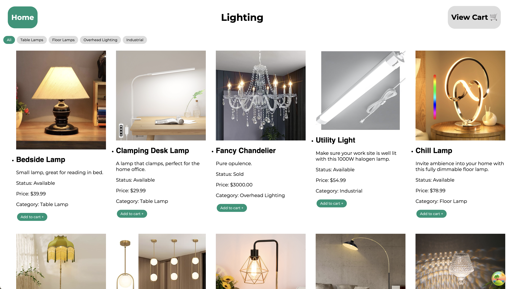
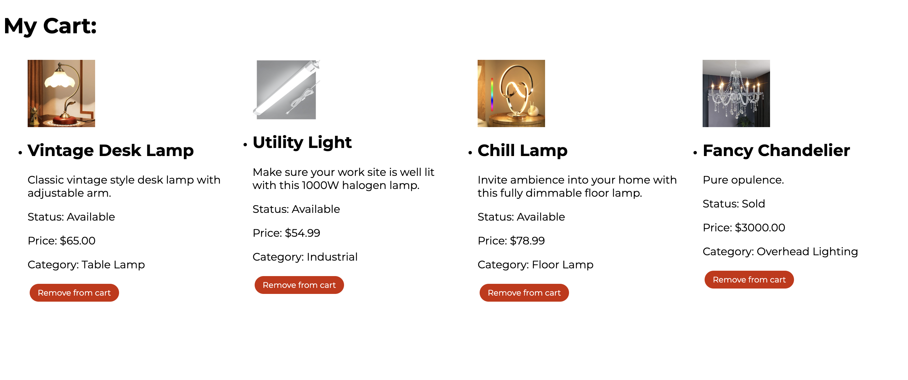
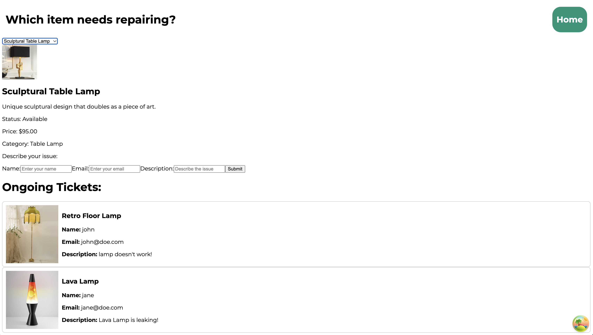

# Description

GlowUp is a web application created for finding and purchasing the most incredible Lamps you have ever seen. This was a fun project created by myself and a team through our studies at Dev Academy Aotearoa, Check it out!

## Sneek Peak






# Prerequisets

Node.js 
npm 
git

## Installation
Cloning the Repository

```
# Clone the repository
git clone https://github.com/joshtaula19/GlowUp.git

# Navigate to the project directory
cd GlowUp
```

# Installing Dependencies 

```
# Install project dependencies
npm install
```

# Running the Project 

```
# Start the development server
npm run dev

```

